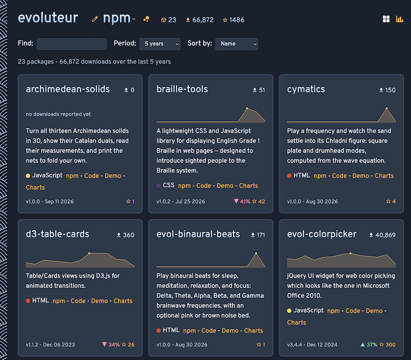
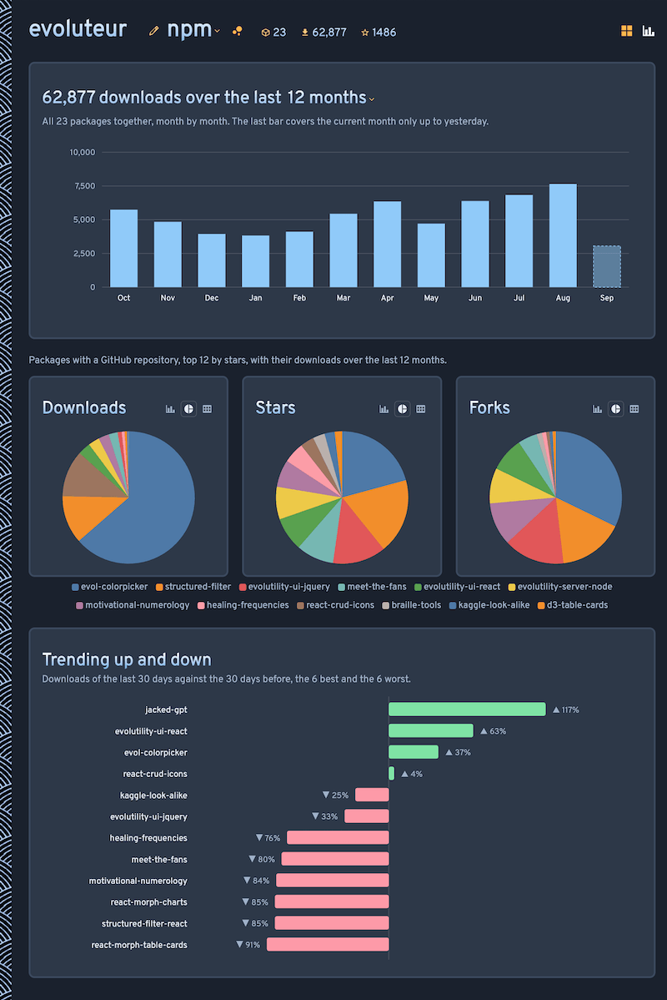

# npm-Pulse

One page to see how all your npm packages are doing: downloads over the last week, month, or year, a weekly sparkline for each package, the trend against the previous month, and the GitHub stars that go with it.

- [See the packages](https://evoluteur.github.io/npm-pulse/)
- [See the dashboard](https://evoluteur.github.io/npm-pulse/dashboard.html)





Everything is computed in the browser from three public APIs - no backend, no build step, no library:

- the [npm registry search API](https://github.com/npm/registry/blob/main/docs/REGISTRY-API.md) for the list of packages published by a maintainer,
- the [npm download counts API](https://github.com/npm/registry/blob/main/docs/download-counts.md) for a year of daily downloads (fetched in a single bulk call),
- the [GitHub API](https://docs.github.com/en/rest) for stars and forks.

The sparklines are 52 weekly buckets drawn as plain SVG, and the charts page shows total downloads month by month plus the ranking of the most downloaded packages. Each panel can be switched between bars, a pie, and a table (top-right toggle); the pie keeps names and values out of the wedges and lists them instead in a color-key legend below the chart.

Downloads are recomputed once a day by npm, so the answers are cached in `localStorage` for 6 hours. Use the "Refresh" link to fetch them again.

## Use it for your own packages

The quickest way is to click the maintainer name in the title and type a different one, or add a `?user=` parameter to the page URL (e.g. `?user=sindresorhus`) - either way it sets both the npm maintainer and the GitHub user (for stars and forks) without editing any file, and carries over between the packages page and the charts page.

To make it stick as the default, change the `user` value (at the top of the [/js/npm-data.js](https://github.com/evoluteur/npm-pulse/blob/main/js/npm-data.js) file) to see your packages instead of mine:

```js
const user = "evoluteur"; // npm maintainer whose packages are shown
const ghUser = "evoluteur"; // GitHub user (for stars and forks)
const cacheMinutes = 360; // npm recomputes its stats once a day
```

Then open `index.html` - there is nothing to install and nothing to build.

GitHub allows 60 anonymous API calls per hour. When that limit is reached the stars simply do not show, and everything else keeps working.

npm-Pulse is open source at [GitHub](https://github.com/evoluteur/npm-pulse) with MIT license.

For more ways to look at your projects check out my other projects [GitHub-Projects-Cards](https://github.com/evoluteur/github-projects-cards) ([demo](https://evoluteur.github.io/github-projects-cards/)) to display your repositories as cards, and [Meet-the-Fans](https://github.com/evoluteur/meet-the-fans) ([demo](https://evoluteur.github.io/meet-the-fans/)) to visualize the network graph of your repositories, followers, stargazers, and forks.

Copyright (c) 2026 [Olivier Giulieri](https://evoluteur.github.io/).
